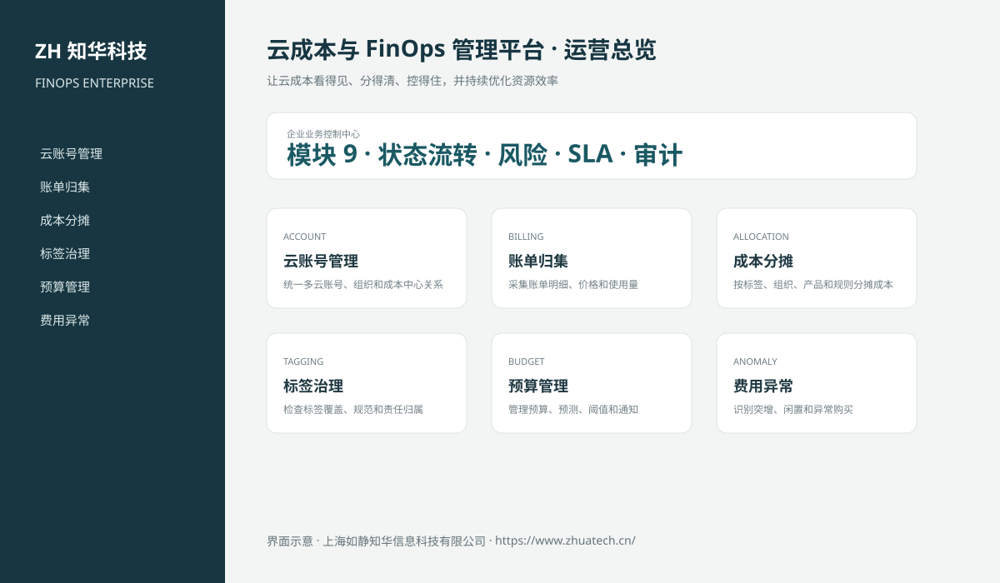

# ZhuaTech FINOPS｜云成本与 FinOps 管理平台

> 让云成本看得见、分得清、控得住，并持续优化资源效率

ZhuaTech FINOPS 是知华科技（上海如静知华信息科技有限公司）发布的企业级源码项目，面向“云账号、账单、分摊、标签、预算、异常、承诺折扣、资源优化与经营分析”提供管理端与响应式业务端。工程采用前后端分离架构，所有示例数据均为虚构数据。

[知华科技官网](https://www.zhuatech.cn/) · [架构说明](docs/ARCHITECTURE.md) · [API 文档](docs/API.md) · [企业能力](docs/ENTERPRISE.md) · [测试说明](docs/TESTING.md)



## 业务模块

| 模块 | 核心能力 |
| --- | --- |
| 云账号管理 | 统一多云账号、组织和成本中心关系 |
| 账单归集 | 采集账单明细、价格和使用量 |
| 成本分摊 | 按标签、组织、产品和规则分摊成本 |
| 标签治理 | 检查标签覆盖、规范和责任归属 |
| 预算管理 | 管理预算、预测、阈值和通知 |
| 费用异常 | 识别突增、闲置和异常购买 |
| 承诺折扣 | 管理预留、节省计划和覆盖利用 |
| 资源优化 | 输出规格调整、关停和存储优化建议 |
| 单位经济 | 关联客户、订单和产品分析单位成本 |


## 企业级控制

- ADMIN / OPERATOR 角色边界和管理员接口隔离；
- 服务端字段、模块、唯一编号和状态迁移校验；
- 组织、期间、责任人、风险等级、到期日和 SLA 统计；
- 幂等创建、JPA 乐观锁、重复提交保护和职责分离；
- 附件 SHA-256 元数据、业务凭证完整性与全流程审计；
- 组合检索、分页、逾期筛选、UTF-8 CSV 导出和协作时间线；
- 外部系统仅预留适配器，使用方自行配置地址与凭据；
- prod profile 拒绝默认密码、弱数据库口令和本地跨域来源。

## 技术架构

- 后端：Java 21、Spring Boot、Spring Security、JPA、Bean Validation、Actuator
- 前端：Vue 3、Vite、Axios，支持桌面端与移动端响应式布局
- 数据库：MySQL 8；自动化测试使用 H2
- 交付：Docker Compose、Nginx、环境变量、GitHub Actions
- Java 包名：`cn.zhuatech.finops`

## 启动与测试

```bash
cd backend && mvn test
cd ../frontend && npm install && npm run build
cd .. && cp .env.example .env && docker compose up --build
```

开发演示账号：`admin / admin123`、`operator / operator123`。生产环境必须通过环境变量替换全部默认凭据。

## 云资源承诺采购

新增预留实例、节省计划等长期云资源承诺前的企业授权门禁，统一核对用量基线、需求预测、折扣、预算、锁定风险、可迁移性、财务审批和退出方案。详见[企业云资源承诺采购](docs/ENTERPRISE_CLOUD_COMMITMENT.md)。

## 许可与商业授权

Copyright © 2026 上海如静知华信息科技有限公司。

本工程仅允许个人学习、研究和非商业技术交流，**不得用于商业用途**。企业内部使用、生产部署、SaaS运营、项目交付、品牌替换、收费培训、咨询实施或再分发，均须事先获得上海如静知华信息科技有限公司书面授权，详见 [LICENSE](LICENSE)。

深度开发、私有化部署、系统集成与企业数字化咨询，请访问[知华科技官网](https://www.zhuatech.cn/)或扫码联系：

| 微信咨询一 | 微信咨询二 |
| --- | --- |
|  |  |

SEO：云成本与 FinOps 管理平台、FINOPS系统源码、企业数字化、Java企业系统、Vue管理系统、知华科技、上海如静知华信息科技有限公司。

## V2.0 专业云成本域

新增云账号、成本预算、账单明细、预算/异常/标签告警和优化建议模型。账单行支持幂等采集、成本中心分摊和月度预算阈值；成本较基线增长超过 50% 自动告警，优化建议记录预计与实际月节省。专业入口为“云成本控制台”，API 根路径为 `/api/finops-ops`。
